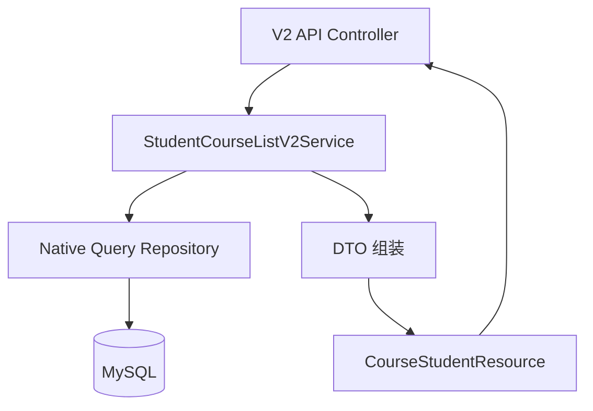

## 产品概述

针对 `/v1/courseTables/studentCourseList` 接口进行性能优化，新增 `/v2/courseTables/studentCourseList` 接口。

## 核心需求

1. **新增 V2 接口**：路径从 `/v1/courseTables/studentCourseList` 变更为 `/v2/courseTables/studentCourseList`
2. **Service 层独立**：新建 Service 文件编写优化逻辑，不影响原有 v1 接口
3. **入参出参不变**：保持与 v1 接口一致的请求参数和响应结构
4. **Native Query 优化**：使用原生 SQL 查询替代 JPA Specification，避免 EAGER Fetch 和 N+1 问题

## 原有性能问题

- 吞吐量：17.3 次/秒
- 响应时间：5289ms
- CPU 使用率：97%（应用层瓶颈）
- 网络带宽：1098.95Mb/s

## 优化目标

- 响应时间降低至 500ms 以内
- CPU 使用率降低至 50% 以下
- 网络带宽占用降低至 500Mbps 以下
- 吞吐量提升至 100 次/秒以上

## 技术栈

- **框架**：Spring Boot + Spring Data JPA
- **数据库**：MySQL
- **序列化**：Jackson
- **构建工具**：Gradle

## 实现方案

### Native Query 优化核心思路

**问题分析**：

- 原 JPA Specification 查询通过 EAGER Fetch 加载了大量关联实体
- 每次查询触发 N+1 问题，导致 200+ 次数据库查询
- 内存中处理大量不必要的嵌套对象

**优化策略**：

1. **精确字段查询**：只查询响应所需的字段，避免 SELECT *
2. **JOIN 一次查询**：通过多表 JOIN 一次性获取所有数据
3. **聚合查询优化**：使用 SQL 聚合函数替代内存计算
4. **投影映射**：使用 DTO 接收查询结果，避免实体映射开销

### 数据库表关系

```
tb_course_table (ct)
  ├─ course_id → tb_course (c)
  ├─ group_id → tb_group (g)
  └─ course_category_id → tb_course_category (cc)

tb_group_member (gm)
  └─ group_id → tb_group (g)

tb_course_table_detail (ctd)
  └─ course_table_id → tb_course_table (ct)

tb_course_table_detail_teacher (ctdt)
  └─ course_table_detail_id → tb_course_table_detail (ctd)
```

### 查询设计

**核心查询（获取学生课程基本信息）**：

```sql
SELECT DISTINCT
    ct.id as course_table_id,
    c.id as course_id,
    c.course_code,
    c.course_name,
    c.college_name,
    cc.id as course_category_id,
    cc.course_category_name,
    g.id as group_id,
    g.group_name,
    g.group_no,
    g.sort as group_sort,
    g.source as group_source
FROM tb_course_table ct
INNER JOIN tb_course c ON ct.course_id = c.id
INNER JOIN tb_group g ON ct.group_id = g.id
INNER JOIN tb_group_member gm ON g.id = gm.group_id
LEFT JOIN tb_course_category cc ON ct.course_category_id = cc.id
WHERE ct.school_year = :schoolYear
  AND ct.term = :term
  AND gm.student_id = :userId  -- 或 gm.open_id = :openId
  AND gm.group_member_status = 0
  AND g.group_status = 0
ORDER BY cc.id, c.id
```

**教师信息查询（单独查询避免笛卡尔积）**：

```sql
SELECT DISTINCT
    ctdt.teacher_id,
    ctdt.teacher_name
FROM tb_course_table_detail_teacher ctdt
INNER JOIN tb_course_table_detail ctd ON ctdt.course_table_detail_id = ctd.id
WHERE ctd.course_table_id IN (:courseTableIds)
```

**班级人数查询**：

```sql
SELECT 
    group_id,
    COUNT(*) as member_count
FROM tb_group_member
WHERE group_id IN (:groupIds)
  AND group_member_status = 0
GROUP BY group_id
```

### 架构设计

